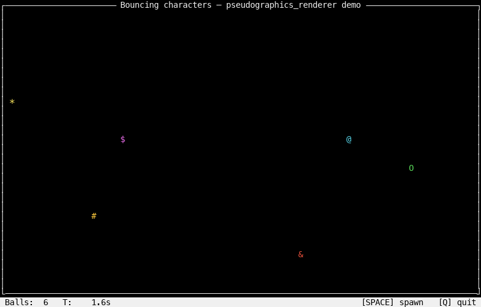

# pseudographics_renderer

A pygame-backed renderer that paints a fixed character grid like a terminal,
but in a real graphics window — so it draws smoothly and reads OS keyboard
events directly. No curses, no terminal emulation, no platform-specific
keyboard protocols. True multi-key hold works everywhere.



*Output of `examples/bouncing_ball.py` — direct character-grid usage, no
`BrailleEngine`. The renderer paints whatever characters the game writes:
box-drawing border, colored ASCII glyphs, plain-text HUD with reverse video.*

## What it does

The renderer takes a 2D grid of cells — each holding a single character, a
color ID, and a reverse-video flag — and blits it to a pygame window. That is
its entire job. It knows nothing about shapes, pixels, or graphics primitives;
those live above it, in the game.

Key properties:

- Same visual model as a terminal: monospace cell grid, colors, reverse video.
- True OS-level keyboard state via pygame, including simultaneous key holds.
- Double-buffered grid: the game writes a frame into the back buffer while the
  renderer paints from a stable front buffer.
- Threaded by default: pygame on the main thread, the game on a worker.

## Architecture

```
┌─────────────────────────────────────────────────┐
│ Game                                            │
│   decides what's at each cell, produces:        │
│      grid[row][col] = (char, color, reverse)    │
└─────────────────┬───────────────────────────────┘
                  │  grid.present()
                  ▼
┌─────────────────────────────────────────────────┐
│ Renderer                                        │
│   - reads the front buffer                      │
│   - paints each non-blank cell                  │
└─────────────────────────────────────────────────┘
```

Three core pieces:

1. **`SymbolGrid`** — the contract. Two parallel buffers of `(char, color,
   reverse)` cells. The game writes to the back; `present()` atomically swaps
   back and front.
2. **`Surface`** — paints the front buffer to a pygame window. Maintains a
   lazy glyph atlas keyed by `(char, color, reverse)`. Most codepoints are
   built via `pygame.font.render`; Unicode Braille (U+2800–U+28FF) is built
   from hand-drawn dots because SDL_ttf can't read Braille glyphs from
   typical system fonts. That fallback is a font-coverage workaround, not
   part of the contract — from the game's side, Braille codepoints are just
   regular characters in the grid.
3. **`Runtime`** — context manager. Opens the window, runs the pygame event
   loop on the main thread, runs the game callable on a worker thread, blits
   the surface every display tick.

## Installation

```bash
pip install -e .
```

Requires Python 3.9+, `pygame >= 2.5`, `numpy >= 1.24`.

## Usage

```python
from pseudographics_renderer import Runtime


def game_loop(grid, input_handler, runtime):
    while runtime.running:
        if input_handler.is_held('q') or input_handler.is_held('escape'):
            runtime.stop()
            break

        grid.clear()
        grid.text(0, 0, "Hello, pseudographics", color=1)
        grid.text(grid.rows - 1, 0, " [Q] quit ", color=1, reverse=True)
        grid.present()


with Runtime(title="Demo", cols=80, rows=25) as rt:
    rt.run(lambda: game_loop(rt.grid, rt.input_handler, rt))
```

`rt.run(fn)` blocks until `fn` returns or the window closes. Pygame must own
the main thread (macOS hard requirement), so the game runs on a worker.

## API

### Runtime

```python
Runtime(
    title="Pseudographics",
    cols=120, rows=40,                 # grid size in cells
    cell_pixel=(8, 16),                # one cell = 8x16 real pixels
    palette=None,                      # list[(r,g,b)]; defaults to DEFAULT_PALETTE
    display_fps=60,
    font_size=14,
    background=(0, 0, 0),
    dot_size=None,                     # Braille dot size (auto-picked from cell_pixel)
)
```

Exposes `rt.grid`, `rt.input_handler`, `rt.running`, `rt.stop()`.

### SymbolGrid

```python
grid.clear()                                   # blank the back buffer
grid.set_cell(row, col, char, color, reverse)  # write one cell
grid.text(row, col, "string", color, reverse)  # write a run at (row, col)
grid.present()                                 # swap back ↔ front
grid.rows, grid.cols                           # dimensions
```

`color` is an integer index into the palette (0..15 for the default palette).
`reverse=True` swaps fg/bg for that cell.

### InputHandler

```python
input_handler.is_held("w")        # WASD letters
input_handler.is_held("up")       # arrows: 'up', 'down', 'left', 'right'
input_handler.is_held("escape")
input_handler.poll()              # no-op, kept for parity with curses-based handlers
```

Recognized keys: `w/a/s/d/q/r/v/n/p`, the four arrow keys, `space`, `enter`,
`escape`. Multiple keys hold simultaneously. `is_held` is thread-safe and can
be polled at any rate.

### Palette

`DEFAULT_PALETTE` is a 16-entry list of `(r, g, b)` tuples covering the
common ANSI-style colors. Index 0 is the default fallback. Pass a custom
list via `Runtime(palette=...)`.

## The Braille module

`pseudographics_renderer.braille.BrailleEngine` is an **opt-in helper** for
games that need finer-than-cell resolution (smooth curves, line art,
plotting). The renderer itself doesn't depend on it; a game that only draws
characters at the cell grid (an ASCII roguelike, a text UI, a TUI dashboard)
ignores it entirely.

The trick: each Unicode Braille character is a pattern of up to 8 dots laid
out in a 2×4 grid, so a single character can represent 8 distinct
sub-character positions. The engine holds an internal pixel buffer at that
2×4-per-cell resolution, exposes the usual drawing primitives, and bakes the
result into the grid as Braille characters at commit time.

```python
from pseudographics_renderer import Runtime, BrailleEngine

with Runtime(title="Demo", cols=120, rows=36) as rt:
    engine = BrailleEngine(cols=rt.cols, rows=rt.rows - 1)  # last row = HUD

    def render_frame():
        rt.grid.clear()
        engine.clear()

        engine.line(0, 0, engine.pixel_w - 1, engine.pixel_h - 1, color=4)
        engine.circle(engine.pixel_w / 2, engine.pixel_h / 2, 30, color=2)
        engine.filled_circle(20, 20, 5, color=8)

        engine.commit_to(rt.grid)                      # subcell shapes -> Braille chars
        rt.grid.text(rt.grid.rows - 1, 0, " HUD ",
                     color=1, reverse=True)            # plain text overlay
        rt.grid.present()

    # ... call render_frame from a game loop ...
```

### Engine API

```python
BrailleEngine(cols, rows)                     # cell dimensions of the engine's draw area
engine.pixel_w, engine.pixel_h                # subpixel dimensions (cols*2, rows*4)

engine.clear()
engine.pixel(x, y, color)
engine.line(x0, y0, x1, y1, color)
engine.polyline(points, color)
engine.circle(cx, cy, r, color)
engine.filled_circle(cx, cy, r, color)

engine.commit_to(grid, row_offset=0, col_offset=0)
```

All drawing coordinates are in **subpixel space**: `(0, 0)` to
`(pixel_w - 1, pixel_h - 1)`. Out-of-range writes are silently dropped.

### What `commit_to` does

For each cell that has any lit subpixels:

1. Pack the 8 lit/unlit subpixels into a Unicode Braille codepoint
   (U+2800..U+28FF).
2. Pick the dominant color among lit subpixels (most-lit-subpixels wins;
   ties broken by highest color id).
3. Write `(braille_char, dominant_color)` into the grid cell.

Cells with no lit subpixels are not touched, so previously written content
(e.g., HUD text) survives. Conversely, calling `engine.commit_to(grid)`
overwrites grid cells that the engine produced characters for — the engine
"owns" the area it draws into.

### Mixing engine output with direct grid writes

Typical pattern: use the engine for the body of the scene, write text
directly to the grid for HUDs, labels, or any character-level overlay.
Engine area + direct text area can overlap, but the **last write wins** —
either commit first then overlay text, or write text first then let the
engine overdraw it.

## Threading model

```
Main thread (pygame)   ── event loop + blits at display_fps
Game worker thread     ── whatever the game callable does
```

Pygame requires the main thread on macOS, so `Runtime.run(fn)` runs the game
callable on a worker and pumps the pygame loop on the calling thread. The
game is free to spawn its own additional threads (e.g., a separate render
thread alongside a physics thread). All thread coordination happens through
the grid's double buffer — the back buffer is the work area, `present()`
publishes it.

`InputHandler.is_held` is locked and safe to call from any thread.

## Notes

- Window size is fixed at construction. Live resize is not implemented.
- Glyphs are cached lazily on first use. After a few seconds of warmup the
  atlas covers everything the game draws and rendering is just lookup + blit.
- The renderer is intentionally minimal. Anything beyond a (char, color,
  reverse) grid — shape rasterization, scene composition, animation timing —
  belongs to the game or to a helper module like `braille`.
